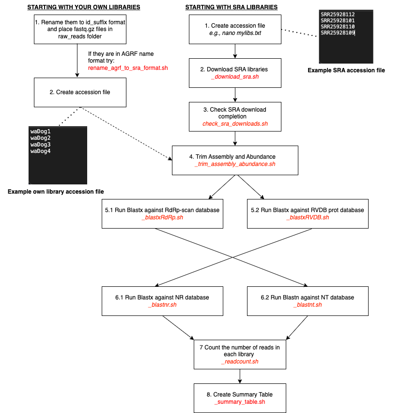

# BatchArtemisSRAMiner

A repo containing tools and shortcuts for virus discovery workflows for the Holmes Lab on the USYD HPC Artemis with a particular focus on SRA mining but can be used with your own sequencing data. The code is a little janky and documentation is a work in progress!

The premise of the workflow is to quickly set up a folder structure and script set for a given project and to provide a repo that we can refer to in our methods section in manuscripts. 

NOTE: This pipeline relies on several databases (NR, NT, RVDB and RdRp-Scan), modules and taxonomy files (NCBI taxdb, taxize, RVDB tax) that are made available on the USYD Artemis server which means that these scripts will not work out of the box outside of USYD Artemis server. At this stage I don't plan on making all of this portable outside of this server but if you are interested in the pipeline and are outside of USYD feel free to shoot me an email.

--------------------
### Table of Contents
- [BatchArtemisSRAMiner](#batchartemissraminer)
    - [Table of Contents](#table-of-contents)
  - [Installation](#installation)
  - [Pipeline](#pipeline)
  - [Other tips](#other-tips)
    - [Monitoring Job Status](#monitoring-job-status)
    - [Job Status Shortcut](#job-status-shortcut)
    - [Common Flags](#common-flags)
    - [Non-SRA Libraries](#non-sra-libraries)
    - [Fastqc](#fastqc)
    - [Storage](#storage)
  - [Troubleshooting](#troubleshooting)
  - [Installing Anaconda](#installing-anaconda)
  - [Acknowledgments](#acknowledgments)
  - [How to cite this repo?](#how-to-cite-this-repo)

--------------------

## Installation

1. Clone the repo `git clone https://github.com/JonathonMifsud/BatchArtemisSRAMiner.git`
4. Enter the scripts folder, edit setup.sh `cd BatchArtemisSRAMiner-main/scripts/; chmod +x ./*; nano setup.sh`
5. Change the `root`, `project` and `email` parameters. 
6. Run the setup script `./setup.sh`
7. `cd ../../` and remove the install files `rm BatchArtemisSRAMiner-main BatchArtemisSRAMiner-main.zip`

Installing Aspera (ascp) is also recommended:
Under the hood Kingfisher is used to try multiple SRA download methods. One of the fastest and most reliable is ENA using aspera. In most cases, aspera will need to be installed. To do this check out the following:
https://www.biostars.org/p/325010/
https://www.ibm.com/aspera/connect/ 

Each general task you want to run is associated with a .sh (shell) and .pbs script. The .sh script works as a wrapper, passing parameters and variables to the .pbs script. After setting up, you usually don't need to edit the .pbs script.

If you are unsure about what variables/files to use just call the help flag `-h` e.g., `_pipeline_download_sra.sh -h` (from verison 1.0.4 onwards)

The scripts are designed to process batches, so they require a list of filenames to run.

--------------------

## Pipeline
The standard pipeline follows these steps:

1. Create an accession file, plain text with the names of your libaries, one per line. These can either be SRA run ids or Non-SRA libaries (!see section Non-SRA libaries). This will be used as the main input for the scripts.
2. Download SRA e.g, `_pipeline_download_sra.sh` Note all the scripts will be renamed to reflect your project name. This can be skipped if you have generated the sequencing data yourself 
3. Check the that the raw reads have downloaded by looking in `/scratch/^your_root_project^/^your_project^/raw_reads` . You can use the `check_sra_downloads.sh` script to do this! Re-download any that are missing (make a new file with the accessions) 
4. Run read trimming, assembly and calculate contig abundance e.g, `JCOM_pipeline_trim_assembly_abundance.sh`. Trimming is currently setup for TruSeq3 PE and SE illumania libs and will also trim nextera (PE only). Check that all contigs are non-zero in size in `/project/^your_root_project^/^your_project^/contigs/final_contigs/`. It is advised to check trimming quality on atleast a subset of samples using the included fastqc scripts. Furthermore check the size of the trimmed read files to ensure that an excessive number of reads isn't being removed. 
5. Run blastxRdRp and blastxRVDB (these can be run simultaneously)
6. Run blastnr and blastnt (these can be run simultaneously). Given an accession file this command will combine the blastcontigs from RdRp and RVDB and use it as input for nr and nt. As such you will notice there is only a single job ran for each instead of an array `JCOM_pipeline_blastnr.sh` `JCOM_pipeline_blastnt.sh`. Output is named after the -f file.
7.  Run the readcount script `JCOM_pipeline_readcount.sh`
8.  Generate a summary table (Anaconda is needed - see below). The summary table script will create several files inside `/project/^your_root_project^/^your_project^/blast_results/summary_table_creation`. The csv files are the summary tables - if another format or summary would suit you best let me know and we can sit down and develop it. You can specify accessions if you only want to run the summary table on a subset of runs -f as normal. IMPORTANT check both the logs files generated in the logs folder `summary_table_creation_TODAY_stderr.txt` and `summary_table_creation_TODAY_stout.txt` as this will let you know if any of the inputs were missing etc. 

The large files e.g., raw and trimmed reads and abundance files are stored in `/scratch/` while the smaller files tend to be in /project/

--------------------

## Other tips

### Monitoring Job Status

You can check the status of a job using `qstat -u USERNAME`. This will show you the status of the batch scripts. To check the status of individual subjobs within a batch, use `qstat -tx JOB_ID`.

### Job Status Shortcut
Replace jmif9945 with your unikey and run the following line to create an alias for `q`. This will display two panels: the top panel shows the last 100 jobs/subjobs, while the bottom panel provides a summary of batch jobs:

`alias q="qstat -Jtan1 -xu ^your_username^ | tail -n100; qstat -u ^your_username^"`
Enter q to check the job status. If you want to make this alias permanent, add it to your .bashrc file:

`nano ~/.bashrc`
Add the line: `alias q="qstat -Jtan1 -xu ^your_username^ | tail -n100; qstat -u ^your_username^"`

Then to load it: `source ~/.bashrc`

Add the commands to your path
`nano ~/.bashrc`
Add the line: 
`export PATH="/project/YOURROOT/YOURPROJECT/scripts/:$PATH"`

Make sure to change the variable names!

Then to load it: `source ~/.bashrc`

### Common Flags

Note: Flags can vary between scripts, If you are unsure about what variables/files to use just call the help flag `-h` e.g., `_pipeline_download_sra.sh -h` (from verison 1.0.4 onwards)

However, the common flags are as follows:

`-f` used to specify a file that contains the SRA run accessions to be processed. This option is followed by a string containing the complete path to a file containing accessions one per line. I typically store these files in `/project/your_root/your_project/accession_lists/`. If this option is not provided, most of the scripts in the pipeline will fail or excetue other behaviours (e.g., see the -f in `trim_assembly_abundance.sh`), as such I always recommmend setting the -f where able so you can better keep track of the libraries you are running. NOTE: The max number of SRAs I would put in a accession file is 1000. If you have more than this create two files and run the download_script twice. The limit is enforced by Artemis/PBS. 

**Less common**
`-i` The input option. This option is followed by a string that represents the input file for the script. This is used most commonly in the custom blast scripts where you are interested in a single input rather than an array of files. 
`-d` The database option. This option should be followed by a string that represents the complete path to a database against which blast will be run.

**Rarely need to change**
The way the pipeline is set up the values for root and project that you entered in the setup script are used as the default project (-p flag) and root (-r flag) values in all scripts.
There may be cases where you want to run these functions in directories outside of the normal pipeline structure. The blast custom scripts, mafft alignment and iqtree scripts are designed with this inmind. Input is specified using -i, while the output is the current WD. With other functions it may just be easier to redownload the github .zip file and rerun the setup script as described above - creating the folder sctruture and scripts for the new project.

`-p` The project option. This option should be followed by a string that represents the project name i.e. what you entered as project in the original setup script. 
`-r` The root project option. This option should be followed by a string that represents the root project name. Use e.g., -r VELAB or the value you entered for root in the original setup script. 

You only need to specify -p or -r if you are going outside of the directory stucture in which the setup.sh was ran for. 

### Non-SRA Libraries

You can also use the script with non-SRA libraries by cleaning the original raw read names. For example, `hope_valley3_10_HWGFMDSX5_CCTGCAACCT-CTGACTCTAC`

E.g., hope_valley3_10_HWGFMDSX5_CCTGCAACCT-CTGACTCTAC_L002_R1.fastq.gz -> hpv3t10_1.fastq.gz
The main thing is that underscores are only used to seperate the ID (hpv3t10) and the read file direction (1) and that the "R" in R1/2 is remove. 

### Fastqc

If you would like to examine the qc of libraries before and after trimming you can use the `_fastqc.sh` script. This takes the standard accession_list file and will run fastqc on the raw reads and the two outputs from the trimmed reads, 1. the trimmed reads i.e. those that are kept and 2. the removed reads. Check `/project/your_root/your_project/fastqc/` for results. So ensure that you run this after the `_trim_assembly_abundance.sh`.

### Storage

I tend to delete the raw and trimmed read files after contigs are the trim_assembly_abundance script has completed as abundance and read count (make sure to run this!) information has been calculated at this stage. Once the summary table is created there are a couple large files in this directory including the concatentated abundance table. This can be remade so consider removing this if you are low on storage. 

--------------------

## Troubleshooting

If your SRA fails, check the error and output logs in the logs folder in the project branch.

Downloading Failure
Downloads often time out, and while the script will attempt to download multiple times, it might eventually fail. If this happens, use the check_sra_downloads.sh script to identify which libraries failed. This script will generate a file that can be fed back into -f.

Other reasons for download failure could be invalid SRA run id or insufficient storage space in the directory.

Trimming/Assembly Failure
The most common cause of trimming/assembly failure is a corrupt download. In this case, it's best to remove, redownload, and reassemble the data.

PBS job rejected from all possible destinations. Make sure you have less than 1000 accessions. Also ensure that you have updated the pipeline to v1.0.1 as there is a mistake in the inital release that results in an invalid walltime being requested. 

--------------------

## Installing Anaconda

Conda is a package manager that can be used to install packages that aren't readily available through the module. This is necessary because Artemis lacks some required modules/module versions. The primary use cases here are CCmetagen and the summary table script.

Download the Anaconda installer script from the Anaconda distribution site. You can use the wget command to download it.
`wget https://repo.anaconda.com/archive/Anaconda3-4.3.0-Linux-x86_64.sh`
`bash Anaconda3-4.3.0-Linux-x86_64.sh`

You may get a certificate error, you can get around this using `--no-check-certificate` in the `wget` command.

Press ENTER to continue and review the license agreement. Press `ENTER` again to move through the text. Once you've reviewed the license, type `yes` to agree to the terms.

The installer will prompt you for the location of the installation. As there is very limited space in your home directory (e.g., /home/jmif9945/) installing Anaconda here isn't a great idea. Instead install it in your main project home directory by specifying the path:
For example:
`/project/^your_root_project^/anaconda3`
You can press `ENTER` to accept.

At the end of the installation, you'll be asked if you want to run conda init. We recommend saying `yes` to this option. This will make Anaconda usable from any terminal session.

Activate Installation
Close and re-open your terminal. You should now have access to the conda command.

Conda will sometimes require more memory than the head node can provide causing memory issues when running `conda install` or `conda env create`. To get around this we can create a interactive environment using the following:
`qsub -I -l select=1:ncpus=4:mem=20GB -l walltime=4:00:00 -M ^your_email^@uni.sydney.edu.au -P ^your_root_project^ -q defaultQ  -j oe`

To create the environments run the following:
`conda env create -f /project/^your_root_project^/^your_project^/environments/ccmetagen_env.yml`
`conda env create -f /project/^your_root_project^/^your_project^/environments/project_pipeline.yml`
`conda env create -f /project/^your_root_project^/^your_project^/environments/r_env.yml`

If you run into an errpr saying CondaHTTPError... you can run `conda config --set ssl_verify no` and then try creating the environment again. 

--------------------

## Acknowledgments
I'd like to acknowledge past and present members of the Holmes Lab for their contributions to the development of this pipeline. Extra special thanks goes to Susana Ortiz-Baez, Vince Costa, Erin Harvey, Lauren Lim, Mary Petrone and Sabrina Sadiq for suggestions and/or bug reports!

--------------------

## How to cite this repo?
If this repo was somehow useful a citation would be greatly appeciated! Please cite as Mifsud, J.C.O. (2023) BatchArtemisSRAMiner v1.X.X. Zenodo. https://doi.org/10.5281/zenodo.10020164. Available at: https://github.com/JonathonMifsud/BatchArtemisSRAMiner/ .You can also get a reference file if you click on the doi badge at the top of the repo or visit this link https://zenodo.org/record/8417951
